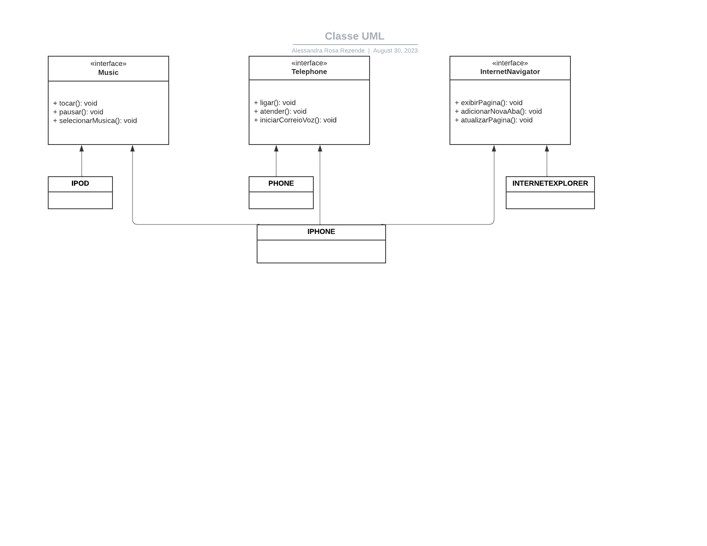

# POO - Desafio

Modelagem e diagramação da representação em UML e Código no que se refere ao componente iPhone.

Com base no vídeo de lançamento do iPhone, elabore em uma ferramenta de UML a diagramação das classes e interfaces com a proposta de representar os papéis do iPhone de: Reprodutor Musicial,  Aparelho Telefônico e Navegador na Internet. Em seguida crie as classes e interfaces no formato de arquivos .java

###### Comportamentos esperados:
* Repodutor Musicial: tocar, pausar, selecionarMusica
* Aparelho Telefônico: ligar, atender, iniciarCorrerioVoz
* Navegador na Internet: exibirPagina, adicionarNovaAba, atualizarPagina

###### Readme completo [nesse link](https://github.com/digitalinnovationone/trilha-java-basico/blob/main/desafios/poo/README.md)

## Diagramação UML:

